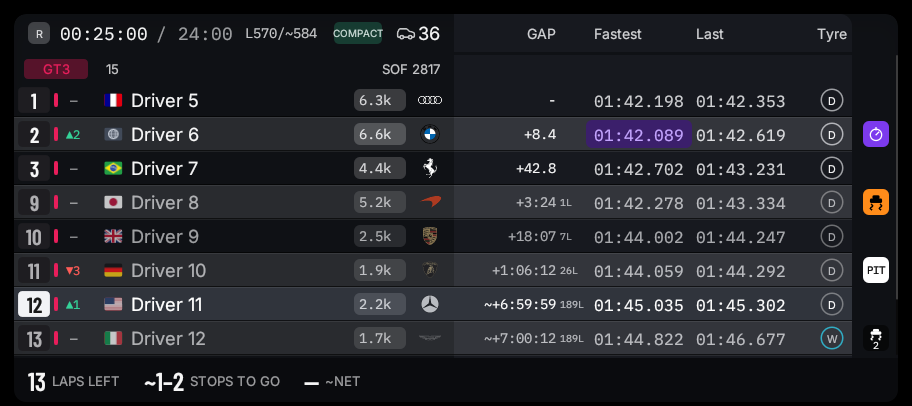
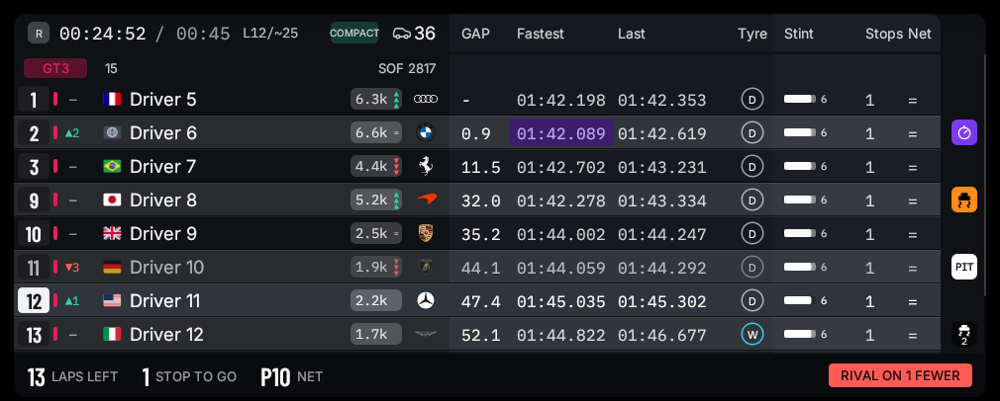
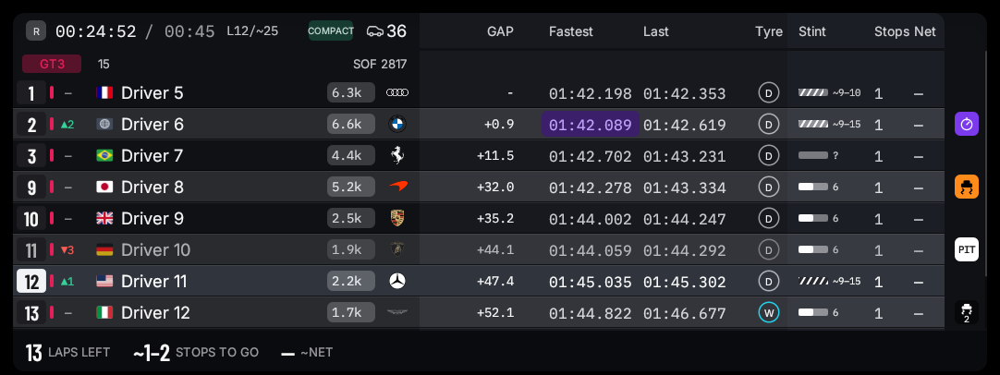
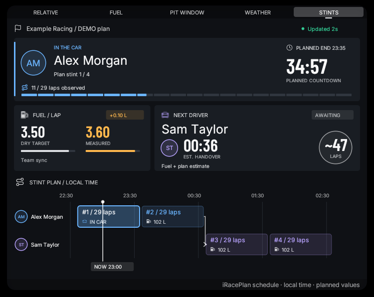
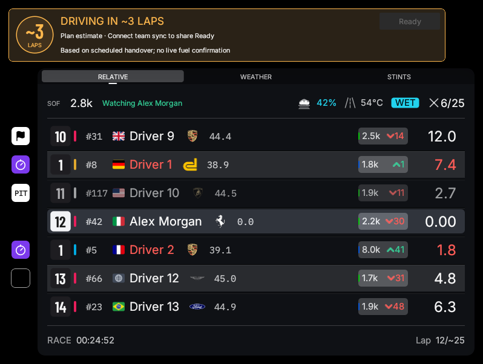
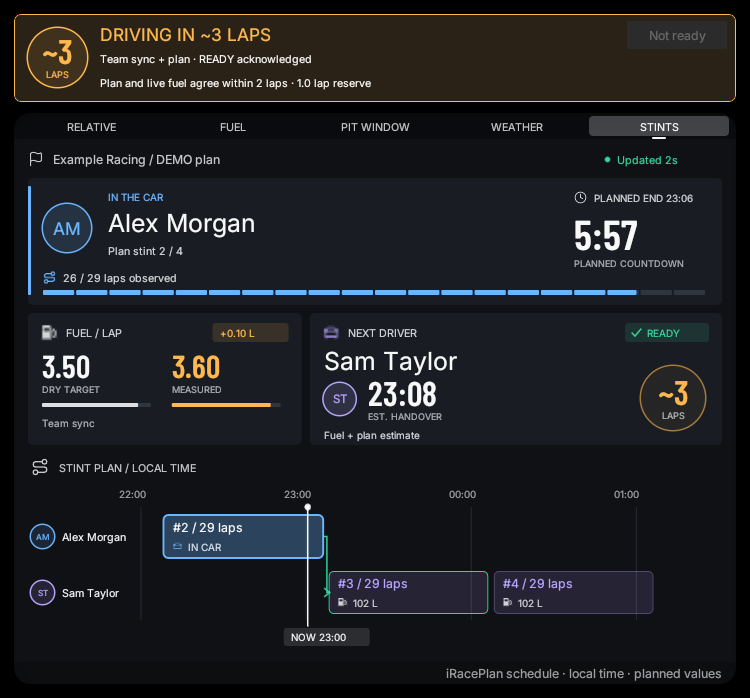
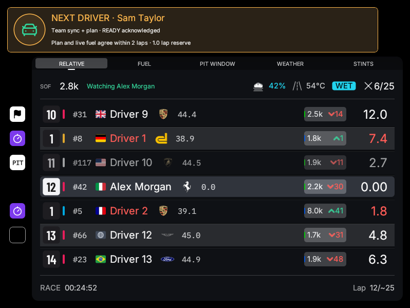
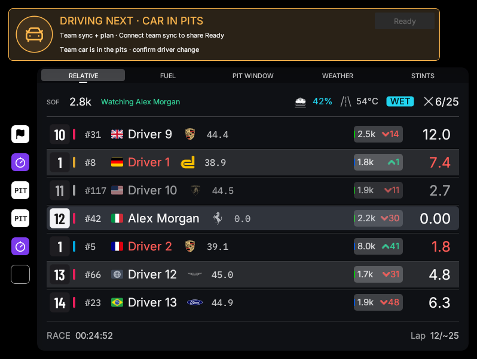
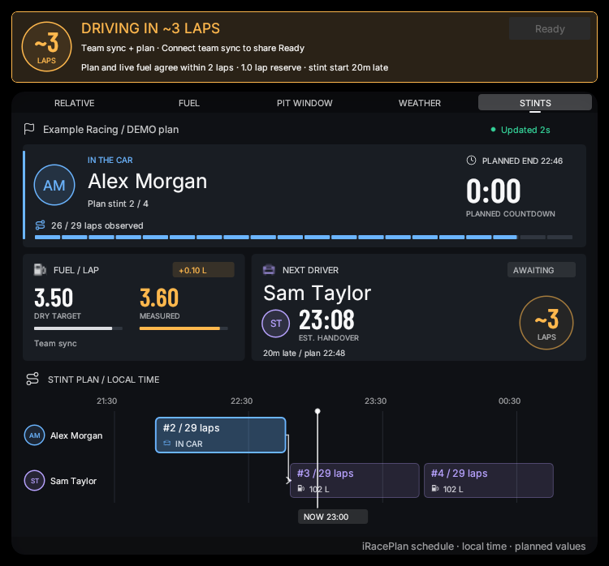
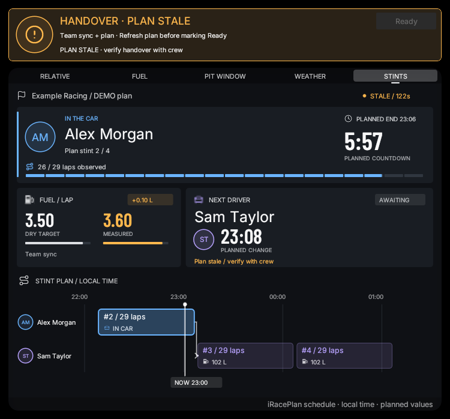

# Race Overlay

An iRacing overlay for endurance and multi-class racing: four draggable panels, a wheel-driven black box,
and a team-sync layer that lets a crew chief watch — and adjust — the car they are not sitting in.

Every screenshot here is rendered by the overlay itself from a fixed demo snapshot, so what is shown is
exactly what the code draws.

**Install, configure and build:** see [the manual](docs/manual.md).

**Endurance reliability audit:** see [the findings, fixes and live rehearsal checklist](docs/endurance-audit.md).

**Contents** — [Relative](#relative) · [Black box](#black-box) · [Standings](#standings) ·
[Radar bars](#radar-bars) · [Faster class](#faster-class) ·
[Status border](#status-border) · [Strategy](#strategy--fuel) ·
[iRacePlan stints](#iraceplan-stints--handovers) · [Team sync](#team-sync) · [Danger drivers](#danger-drivers) · [Seat layouts](#seat-layouts) ·
[Stream mode](#stream-mode) · [CPU](#cpu-behaviour) · [Themes](#themes) · [Settings](#settings-window) ·
[Binds](#wheel-binds) · [Command line](#command-line)

---

## What this is

A single always-on-top window covering the screen, drawing panels over iRacing and passing every click
through to the sim except where a panel actually is.

- **Four panels**, each independently positioned, scaled and switched off: Relative, Standings, Radar Bars
  and Faster Class.
- **A black box** sharing the Relative's frame — up to seven pages walked with wheel buttons, with real pit service
  control (fuel, tyres, pressures, tearoff, fast repair).
- **Estimates are labelled and honest.** Anything projected says so, and anything the sim has not published is
  left blank rather than guessed — a made-up number on a pit board loses races.
- **No slanted geometry.** Straight-edged blocks throughout.

Start `race-overlay.exe` and open **Settings** from its native tray menu (or left-click the icon).
The **General** page enables or disables each widget; **Configure** opens its settings and previews only
that widget. Layout, content and column controls are grouped into separate tabs. Drag a preview into place:
its position stays put when switching pages and is saved automatically. Changes are written to
`%APPDATA%\race\race-overlay.toml` once they stop changing. The tray menu also has **Quit**.

---

## Relative

The cars around you in time order, with the status gutter outside the card on the left. This is page one of
the black box, so the tab rail across the top belongs to it.


Position on its plate, car number, driver flag, name, manufacturer mark, recent pace, the iRating badge
(bordered in the licence-class colour, carrying the projected change), and the gap. A car on a different lap
is coloured — red for a car about to lap you, blue for one you have lapped — and a car in the pits is greyed
out whole. The class reads from the wash behind the name.

The **status gutter** sits outside the card, one slot per row, so an annotation about a car never competes
with the driver's name for space. In priority order: a black-flag marker, the session's fastest-lap
stopwatch, a `PIT` block while that car is in its stall or approaching, an `OUT` block on a confirmed out-lap,
or its off-track tally. Rows with
nothing to report draw nothing.

<details>
<summary><b>Column and layout options</b></summary>

| | |
|---|---|
|  | **Every column is optional.** Car number, manufacturer mark, recent lap and iRating badge each switch off; the name column absorbs the space rather than leaving a hole. |
|  | **Width and depth are configurable.** Narrowing trims the name run — long names gain an ellipsis — while the fixed columns keep their measured widths. |
|  | **Position change** can measure this lap or the whole race, or be off. A car that has not moved shows nothing — on a panel about right now, silence is the usual state. |
|  | **On the grid**, the clock's place is taken by how many cars are gridded and how long is left. |

</details>

<details>
<summary><b>Who the panel is about</b></summary>

| | |
|---|---|
|  | **Spectating.** The panel centres on the camera car and says whose race it is showing. A Relative quietly about somebody else is the one way spectator focus could mislead. |
|  | **A team-mate in your car.** Same slot, same colour: for a team-mate's stint this is the normal state of the panel for hours, not a warning. |

</details>

---

## Black box

Six built-in pages in the Relative's frame, walked with two wheel buttons, plus the optional
[iRacePlan Stints page](#iraceplan-stints--handovers). Pit-service controls send real iRacing commands
and show the sim's echo of what is armed. Schedule and strategy estimates are labelled separately.

| | |
|---|---|
|  | **Fuel.** The tank arc with what is in it and what is armed to be added, laps of fuel at the measured burn, and the arm/clear controls. Fuel steps in whole litres because that is what the sim's command carries. |
|  | **Auto Fuel.** Keeps the load set to whatever finishes the race plus a margin in laps. The Add row goes read-only while it is on, because it is no longer yours to set. |
|  | **Tires.** Four corners, each with its armed tick, cold pressure and three bars across the tread. A press arms the corner; a turn steps pressure by a whole psi — the sim's own increment. |
|  | **Bars show temperature or wear**, from the last stop. Before any stop the page says so rather than drawing zeros as though they were measurements. |
|  | **Pit Window.** Which lap to come in on, scored against the traffic you would rejoin into — see [Strategy](#strategy--fuel). |
|  | **In-Car.** Brake bias, ABS, traction control, throttle shape and dash page as the car publishes them. A reading, not a control: the sim accepts no remote writes for these. |
|  | **Weather.** Track and air temperature, live rain or the declared chance, fog, and the wind as an arrow in the car's own frame. Current conditions, honestly labelled as such: iRacing publishes no forecast. |

> **Pages appear only when they can say something true.** The Pit Window page appears once the race is seen to
> need more than one stop. While spectating, Fuel and Tires appear only when team sync is actually carrying the
> driver's data — an empty page that looks live is worse than no page.

---

## Standings

The official classification, read class-relative: in a multi-class field every class is running its own race,
and an overall number reads as a driver being fourteenth in a race they are leading.


The compact view keeps a class-relative selection around the driver or watched car, with optional leaders
from other classes and the session badge and clock across the top. Rows tumble to their new slot when
positions change, so a change is seen to happen rather than the table silently being different.

**GAP / INT.** Choose the class leader, the next classified car, or **Auto** in Settings → Standings →
Content. Auto alternates the two readings every five seconds by default (configurable from 1 to 120 seconds)
and marks the active heading `AUTO`. Clicking the heading also cycles modes while the overlay is interactive.
Intervals remain useful when both cars are laps behind the leader. Position numbers use shared scoring instead
of the locally rendered subset. SOF is a fixed estimate from the session roster.



**Long total gaps.** GAP stays a total deficit: tenths below a minute, `M:SS` below an hour, then
`H:MM:SS`. A small, muted `nL` suffix preserves the lap deficit. Hover for the full seconds value.
`~+` identifies an estimated total; `-` means a usable time gap is unavailable.

**Watching a race.** Settings → Standings → Content can keep a full classified table for a spectator or
team-mate seat. Click **FULL** in the standings heading to expand it immediately; the fixed headings remain
visible while every selected class scrolls below. **Visible rows** sets the panel's bounded height, and the
compact/full choice is saved for the next time you watch.

**Unseen stints.** A solid stint number and bar are observed. `~12` is an inferred single age, while
`~9–15` is its plausible range; inferred bars are hatched and `?` means no trustworthy boundary. A `~NET`
uses an inferred stint or scorer fallback, and the summary shows a stop range instead of a made-up count.

**Team-driver strength.** In team races, the iRating badge carries up to three green or red chevrons when
the current driver can be ranked among drivers seen for that entry's team. Hover it for the rank, whether it
uses iRating or clean completed-stint pace, and the provisional known-driver list.



An unrendered car keeps its scored standings row. `TOW` requires the player's positive iRacing tow timer;
rival absence alone never claims a tow. The countdown shows time remaining, not time since a car vanished.

| | |
|---|---|
|  | **Endurance columns** — stint length, completed pit stops, and projected finishing position. The race summary below separately shows estimated stops still to go. |
|  | **Compound column and stint laps.** The compound letter appears only when the session publishes compounds; wets are ringed blue. |
|  | **Unseen-stop confidence.** Tildes and hatch marks preserve an inferred range; `?` withholds a boundary the overlay cannot establish. |

---

## Radar bars

Two capsules framing your car, one per side. Colour encodes threat, not direction — once your own car is
drawn on the bar, position already says which side a car is on.

| | |
|---|---|
|  |  |
| **The bars.** A car with clear air is slate; closer cars escalate. The gap between the capsules is set to frame your car's width in your own seating position. | **Gaps in metres**, optionally, for setting the range up the first time. |

---

## Faster class


A quicker car is coming. The card appears at a configurable gap and turns red at a closer one, optionally
flashing. In a multi-class race the Relative does show this — as one row among eight, read foveally — and
being lifted out of it is the point.

---

## Status border

The black box wears the session's state on its edge, so the one thing that matters right now is visible
without reading a single row.


The border wraps the card, leaving the status gutter outside it. The status label sits entirely above the
border. While watching another driver, their name shares the Relative's SOF/weather line.

| | | |
|---|---|---|
|  |  |  |
| **CAUTION** — a full-course yellow. | **LAST LAP** — the white flag. | **FINISH** — the chequered, which outranks everything. |

**When BOX BOX fires**

- **By hand**, from a toggle on the Pit Window page — a crew chief's call, or your own reminder.
- **By fuel**, once you could not safely complete another lap after this one, and only in the lap's back half,
  so the call is a settled "turn in at the end of this lap" rather than a first-corner guess. With no measured
  burn it never fires: a made-up "box now" is the one false instruction that costs a race.

It comes on steady and only pulses inside 400 m of the pit entry, so the flash means "turn in now". A
hand-called BOX BOX clears itself once the car is on pit road. Priority: chequered > box call > white >
yellow — a box call outranks the flags behind it, because boxing under a yellow is exactly what you do.

---

## Strategy & fuel


**The pit window.** Each candidate lap is scored against the traffic you would rejoin into — the tall column
is the recommendation, the red line where the tank runs out. Underneath: whether the rate the recommendation
asks for is actually being driven this lap, how much of the field could be seen (*confidence*), and the lap
the tank reaches.

**The stop-skip suggestion.** The note reading *"save to 2.58 L/lap to skip a stop"* is the Spa call
surfaced: it searches for the smallest per-lap saving that removes a whole stop from the remaining race, and
says so only when the saving is reachable. No measured burn, no known tank capacity, or a caution voiding the
projection all leave it unsaid rather than guessed.

**Known stop costs.** Stops are costed from what has actually been observed — each car's own measured time
stationary — rather than a single shared guess, so a car taking tyres every stop is projected with its real
loss. Rivals' stop lengths are what the tyre inference is drawn from.

**NET means the finish.** It ranks the class after every car completes its expected remaining race stops.
It includes lane transit and service cost; a stop already paid is not charged again. `~NET` marks a
projection that depends on scoring data for cars without current local progress. It remains an estimate
of rival strategy; see [the calculation and its limits](docs/net-position.md).

---

## iRacePlan stints & handovers

Join an iRacing session and the overlay automatically checks iRacePlan for its stint plan.
**Stints** appears when the event's track, team, car and dates match. It uses the strategy named in
iRacePlan's schedule, with no race or strategy selection required.
It shows the current or upcoming driver, planned end/start countdown, fuel target versus measured burn,
next driver change, and the next three stints on a time-based board. The right-hand card gives the
incoming driver, estimated change time, laps remaining and Ready status their own space. Times use
your computer's local timezone.



**Read the rotation at a glance.** Driver colours connect the current-driver card, incoming driver and
calendar lanes. Blocks are sized by planned duration; separate blocks show a driver staying in for
another stint. An arrow marks a driver change, a moving **NOW** line locates the clock, and a green
outline marks an acknowledged next assignment. Hover a block for exact times, laps and fuel load.
The current driver's segmented bar labels observed laps or schedule progress explicitly.

**Fuel target versus actual.** The driver's configured dry/wet target sits beside measured litres per lap
and the difference. Live comparison requires a matching race, track, team and car. Spectators use fresh
team-sync measurements; a missing reading is shown as unavailable. If the actual driver differs from the
plan, the page says so and looks up that driver's own target.

**Incoming-driver warning.** Near the next handover, an amber banner above any Black Box page tells the
incoming spectator **DRIVING IN ~3 LAPS** (or fewer). It follows the planned team car even when the camera
is watching someone else. The estimate combines planned progress, observed stint age and pace, and matching
team-sync fuel with your fuel reserve. Without live fuel, it explicitly says **Plan estimate**.

| State | What the crew sees |
|---|---|
|  | **Plan only.** The warning still appears without live fuel confirmation. Ready requires a team-sync connection. |
|  | **Ready acknowledged.** The incoming driver clicks **Ready** to share their acknowledgement, then **Not ready** to revoke it. The acknowledgement belongs to the exact assignment; a changed driver or start time needs a new one. |
|  | **Crew view.** Other team members see the next driver's acknowledgement above their current page. Ready records what the driver said; it does not prove they are still online. |
|  | **Car in the pits.** The banner changes to **DRIVING NEXT** and asks the crew to confirm the driver change. A low tank or pit entry alone does not confirm the team's handover decision. |

<details>
<summary><b>Delays and stale plans</b></summary>

| State | What changes |
|---|---|
|  | **Running late.** Observed pit-exit age can keep a delayed double stint attached to its assignment. The live-fuel projection shows an estimated handover and its shift from the plan; ambiguous progress falls back to the labelled schedule. |
|  | **Plan unavailable.** Failed updates retain the last schedule with **STALE** labels and disable new Ready acknowledgements until the plan refreshes. |

</details>

Every new session gets one schedule check, followed by details for any matching candidates.
A detected plan refreshes every 30 seconds. With no match, Stints stays hidden and there are no
further background requests until another join. Disconnecting also hides Stints and stops requests.
Tabs and redraws never make requests.
Estimated times stay in the overlay: the documented API does not
support strategy edits, so revise the website plan in iRacePlan. All teammates and the relay need sync
protocol **9** for shared Ready. See [connection setup and estimate limits](docs/iraceplan.md).

These are synthetic demo captures, rendered through the same UI and event store as a race. The Ready
capture starts with an acknowledgement already present; demo mode does not connect to a relay.
Regenerate them with [the screenshot script](docs/features/shoot.ps1), or preview a state directly:

```powershell
race-overlay.exe --demo --demo-page=stints --demo-state=handover-ready --screenshot=handover.png
```

---

## Team sync

Team sync shares the seated driver's private measurements, so a spectating crew chief sees fuel, tyres and
strategy for that car. Public telemetry is collected locally and can differ with each client's rendered
car limit. Reconnecting clients recover the shared event history while a relay or replica still holds it.

**How it works**

- **An event ledger.** The driver publishes completed laps and changed tyre readings. Current fuel and pit
  settings run at up to 1 Hz while somebody is listening, with a two-second heartbeat when unchanged.
- **iRacing's own session clock stamps every event**, so members merge them deterministically whatever the
  network delays. Accuracy comes from the timestamp, not from sending fast.
- **Recovery only transfers missing history.** Surviving clients can also restore a restarted relay.
  Historical pit commands rebuild history without issuing controls.
- **Rooms include SubSessionID and SessionNum**, separating practice, qualifying and race history. An
  invite code limits access. All members need the same protocol version; this build uses version 9, including the relay.

**With only spectators connected**, each overlay keeps collecting public telemetry locally. Spectators
do not broadcast fuel or tyre measurements; they send explicit crew decisions and requested recovery
data. Without a connected driver, private readings expire after five seconds. Public rival stop/stint
histories are not currently replicated, and history is lost if every holder exits.

**Hosting.** One member ticks *Host the relay from this PC* in Settings → Team Sync. The relay runs inside the
overlay — no terminal, no second program — and binds to that machine only. Teammates reach it through the
host's Tailscale Funnel, so only the host installs anything:

```
tailscale funnel 41230
```

The address that prints goes in every teammate's **Relay URL** as `wss://…`, with the same invite code. A host
who leaves the invite field empty gets one generated and saved the moment hosting starts; while hosting, that
overlay connects to its own relay automatically and the URL field is greyed out.

Relay URL and invite fields have **Copy** and **Paste** buttons, plus Ctrl+A/C/V/X shortcuts. Pasting trims
surrounding whitespace; correcting either field reconnects automatically.

**What a crew chief sees**

| | |
|---|---|
|  | **The driver's real tank** — level, burn and armed load, tagged with whose car it is. Fuel can be adjusted from here: it travels the wire as intent, and the driver's own overlay arms it. |
|  | **The driver's tyre life** — the last stop's wear, temperatures and the pressures they came off at, plus what is armed for the next stop. This is what the double-stint decision is made on. |

> **Nobody's pit box is touched without consent.**
> - The driver arms *Let my team adjust my pit box* once per session. Off, remote requests are ignored.
> - A change is **announced, never prompted** — a passive "set by \<name\>" note. A driver mid-corner cannot
>   answer a dialog.
> - Every change lands in the sim's own black box, where the driver can see and override it.
> - A write applies **once, live**. A reconnecting driver replaying an hour-old ledger never has a stale
>   command sprung on them — that property is covered by an end-to-end test.

**Standing calls**


Below the window: the manual BOX BOX, the shared **fuel target**, and the standing **tyre policy**.

*Shared fuel target* — a crew chief sets a litres-per-lap target and it appears in the driver's Relative
footer, with their current burn beside it and the lap the tank reaches at that rate. Green at or under target,
amber over. It is session state: it survives driver swaps and reaches a new driver who was a spectator when it
was set, without anyone re-sending it.


*Standing tyre policy* — the answer to "do we take tyres at the next stop?", made durable. A press cycles it:

| Setting | What the driver's overlay does at each stop |
|---|---|
| `driver's call` | Nothing — the directive is off. |
| `every stop` | Arms all four. |
| `never` | Clears all four — the double-stint call. |
| `wear under N%` | Takes tyres only when the worst corner's remaining tread is at or under the threshold (default 80%, stepped by 5). With no wear measured yet it takes tyres: fresh rubber is the mistake that cannot lose a race. |

It is decided at the **pit-road entry edge**, once per entry, against the latest measured wear — so a policy
set mid-stint still lands on the very next stop — and goes through the same consent gate and "set by" note as
any other crew write.

---

## Danger drivers

You see somebody drive badly and want the overlay to remember it — now and in every future session, so the
moment they show up around you again the warning is already there.


Three levels, worked into the row itself rather than added as another icon on the end: **caution** is a short
amber bar beside the position plate, **warning** takes the row's full height, and **severe** is full-height in
the alert red with the row's wash turning red behind it. The level reads from how much of the row the mark
claims.

**Right-click any row** to mark that driver or clear the mark — the driver is marked where they are seen, with
no list and no separate screen. Marks are keyed by iRacing customer id, the one identifier stable across
sessions, and are written straight away. A car whose entry publishes no customer id says so rather than
offering a mark that would not survive the session.

---

## Seat layouts

Every panel keeps two positions: a **driving** layout and a **watching** one. The watching layout is used
whenever you are not in the car — spectating, or sitting out while a team-mate drives — and it seeds itself
from the driving layout the first time it is used, so the two only diverge once you actually drag something
while watching. The General settings page names which one is in force, because a panel that "won't stay where
I put it" after a seat change would otherwise read as a bug.

---

## Stream mode

The overlay normally hides itself from the taskbar and alt-tab, which also hides it from OBS's window picker.
**Stream mode** (General settings) puts it back in both, so OBS lists *Race Overlay* as a Window Capture
source — use the *Windows 10 (1903 and up)* capture method and layer it over your game capture. The taskbar
button is the visible confirmation it took effect. It applies immediately, with no restart.

---

## CPU behaviour

iRacing is sensitive to CPU starvation, and an overlay that glitches the sim is worse than no overlay.

- **Background threads are marked for efficiency cores.** Telemetry reading, the input reader and every
  sync socket thread run under EcoQoS, which asks Windows to schedule them off the cores the
  sim wants.
- **The frame loop is paced, not spun.** The overlay draws at its own interval and sleeps in between, rather
  than repainting every time the desktop mouse moves across it.
- **Asset lookups are resolved once** and remembered — manufacturer marks and icons used to cost tens of
  thousands of filesystem calls a second across a full field.
- **Sync sends nothing nobody is listening to.** The 1 Hz scalars tick is gated on somebody being in the room,
  and quantized so an unchanged value sends nothing at all.

---

## Themes

| | |
|---|---|
|  |  |
| **Panel** — the default: translucent near-black cards with alternating row stripes. | **Instrument** — a tighter bezel, more opaque, no alternating fill: rows are told apart by the dividers between them. |

---

## Settings window

Every knob in the settings file, without the file. Changes apply to the live panels as they are made — the
panel behind the window is the preview — and are saved once they settle.

| Page | What is on it |
|---|---|
| General | Theme, hide-while-unfocused, hide-in-garage, off-track tally, driver flags, stream mode, which seat layout is in force, and **Reset all positions**. |
| Relative | Visibility, scale, card width, cars ahead/behind, and every optional column. |
| Standings | Visibility, scale, name-column width, compact/full spectator view and its visible rows, other classes, stint laps, compound column, position change, endurance mode, pit-loss and tyre-change thresholds. |
| Logos | Manufacturer mark style and colour, with every known brand drawn as it will appear and a per-brand override. |
| Radar Bars | Car length, range in car lengths and in time, bar size, the gap between the capsules, gaps in metres. |
| Faster Class | Visibility, scale, warn/alert gaps and flash. |
| Black Box | Page order and visibility, Auto Fuel and its margin, tyre bar mode, and automatic iRacePlan detection and API-key settings. |
| Team Sync | On/off, **host the relay from this PC** and its port, relay URL, invite code, and the pit-control consent. |
| Binds | One row per wheel action, with press-to-capture. A control already bound elsewhere is taken anyway and the clash shown on both rows. |
| Launcher | The programs to start with the overlay. |

---

## Wheel binds

The black box is meant to be driven from the wheel at speed. Seven actions, bound to buttons or keys:

| Action | On a page | On the Relative |
|---|---|---|
| Next page / Previous page | Walk the tab rail | — |
| Next / Previous | Move the cursor down or up the page's rows | Scroll toward the cars behind or ahead |
| Increment / Decrement | Raise or lower the selected value | — |
| Toggle | Tick or untick the selected option | Recentre on the player |

Whatever is already held when a capture starts does not count, so a shifter resting in gear cannot be the
answer. Binds can also be set from a terminal with `race-overlay.exe --bind <action>`.

---

## Command line

| Flag | What it does |
|---|---|
| `--demo` | Render the fixed demo snapshot; iRacing is not needed. |
| `--check-config` | Print the settings path, Relative layout and bind count without opening the overlay or printing sync credentials. |
| `--demo-page=<page>` | Open the black box on `relative`, `strategy`, `fuel`, `tires`, `in-car`, `weather` or `stints`. |
| `--demo-settings=<page>` | Open a settings page for a preview, e.g. `general`, `standings`, `black-box` or `binds`. Requires `--demo`; works with `--screenshot`. |
| `--demo-state=<a,b>` | Put the demo snapshot into a named state — a caution, a box call, a spectator's seat or an iRacePlan handover — for a screenshot. |
| `--screenshot=<path>` | Write one rendered frame to a PNG and quit. The window stays hidden for the run. |
| `--sync-host=<port>` | Run the team-sync relay from a terminal, printing the invite code and the funnel command. The settings page does the same without a terminal. |
| `--sync-join=<url,subsession,code,name,custid>` | Join a relay and talk to it — a diagnostic for checking a link end to end. |
| `--bind <action>` | Capture a wheel button for one action and save it. |
| `--list-devices` | Every input device the overlay can see. |
| `--dump-vars` / `--dump-all-vars` / `--dump-session-info` | What the sim is actually publishing right now. The first thing to reach for when a value reads wrong. |

The iRacePlan demo states are `stints`, `handover` (plan only), `handover-sync`, `handover-ready`,
`handover-crew`, `handover-pits`, `handover-delay` and `handover-stale`.
